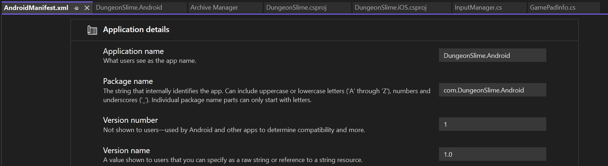
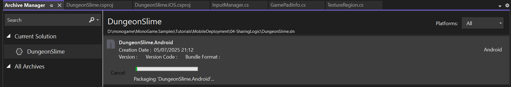
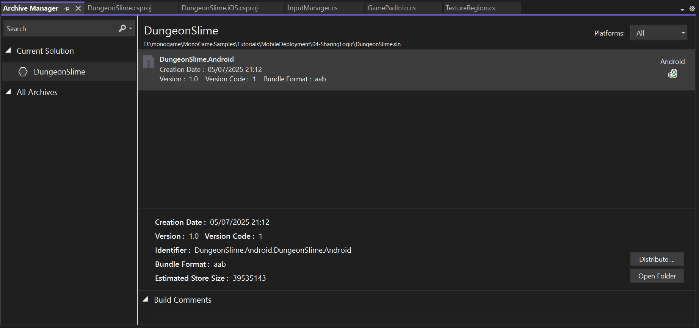
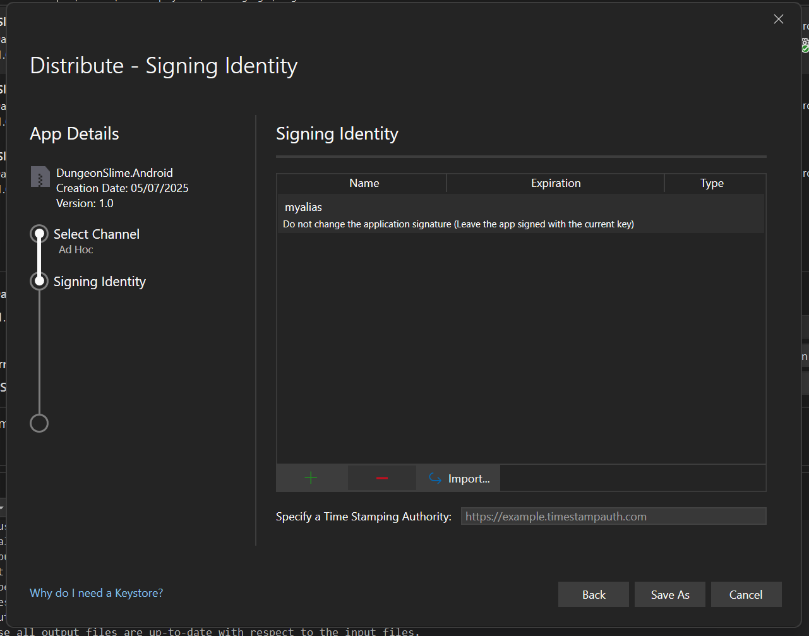
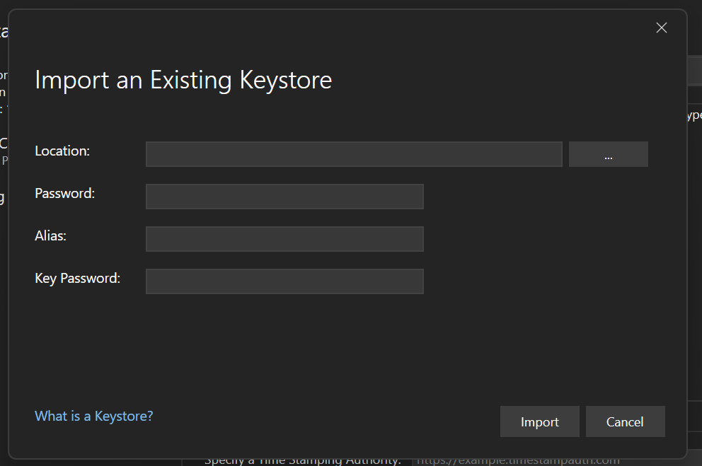
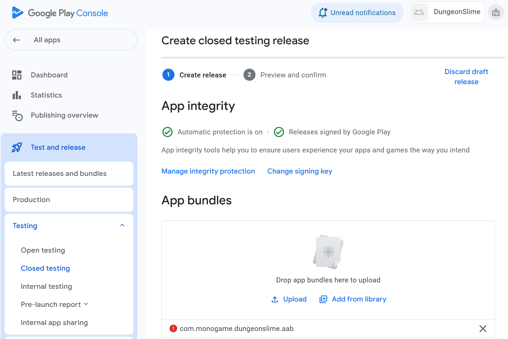

In this chapter you will:

- Configure your Android project for release deployment

- Set up proper package naming and versioning

- Create and manage signing keys for app authentication

- Prepare your app for Google Play Store submission

- Understand the deployment workflow from development to distribution

# Understanding Android App Deployment

Before diving into the technical steps, it's important to understand what happens when you deploy an Android app. Unlike running your game in development mode, releasing to the Play Store requires:

- **Package Configuration**: Your app needs a unique identifier and proper versioning

- **Code Signing**: Android requires all apps to be digitally signed for security

- **Release Build**: Optimized builds that perform better on devices

- **Store Preparation**: Metadata, screenshots, and compliance with store policies

## Preparing Your Project for Release

### Setting Package Information

The first step in preparing your Android project is configuring the package name and version information. This is like giving your app its official identity that will be used throughout the Play Store.

### Package Name and Version Configuration

Your package name serves as the unique identifier for your app on the Play Store. The most reliable way to configure this is directly in your Android project's .csproj file by adding these properties:

```xml
<ApplicationId>com.companyname.DungeonSlime.Android</ApplicationId>
<ApplicationVersion>1</ApplicationVersion>
<ApplicationDisplayVersion>1.0</ApplicationDisplayVersion>
```

These properties control:

- **ApplicationId**: The unique package identifier for your app (equivalent to package name)

- **ApplicationVersion**: The version code - an integer that increases with each release

- **ApplicationDisplayVersion**: The version name that users see in the store

[!IMPORTANT]
The ApplicationId must be unique across the entire Play Store. Use a domain you control (like com.yourstudio.gamename) to avoid conflicts. This cannot be changed after publication.

Alternatively, you can set these values through the Visual Studio interface:

- In your Android project, open the Properties panel.

- Navigate to the Android Manifest section.

- Set the Package name field to your desired identifier (e.g., **com.yourname.gamename**)

- Ensure the name follows reverse domain notation.

## The Package Version

Android apps use two version identifiers:

- **Version Name**: The version string users see (e.g., "1.0.0")

- **Version Code**: An integer that increases with each release (e.g., 1, 2, 3...)

[!IMPORTANT]
Package names must be unique across the entire Play Store. Use a domain you control (like com.yourname.gamename) to avoid conflicts. The package name cannot be changed after publication though.

Set both values in the same properties panel where you configured the package name.

[!TIP]
Use semantic versioning for your version name (Major.Minor.Patch) and increment the version code by 1 for each release, even if it's just a minor update.

In Visual Studio, there is a manifest editor for both editing of name and version:



## Project File Configuration

Before working with the Android manifest, you should configure your project's target platform settings in the .csproj file. This includes setting the minimum supported Android version.

Add the following property to your Android project file:

```xml
    <SupportedOSPlatformVersion>23<SupportedOSPlatformVersion>
```

This setting specifies that your app supports Android API level 23 (Android 6.0) and higher. This is important because:

- It determines which Android devices can install your app

- It affects which APIs you can use in your code
The Play Store uses this to filter app visibility


[!TIP]
API level 23 (Android 6.0) is a good minimum target as it covers the vast majority of active Android devices while still providing access to modern features. You can check current Android version distribution on the Android Developer Dashboard.

## Editing the Android Manifest

For more advanced configuration, you may need to edit the AndroidManifest.xml file directly. This file contains important metadata about your app including permissions, supported features, and hardware requirements.

Common manifest configurations for games include:

- **Screen orientation**: Lock to landscape or portrait

- **Hardware features**: Declare required features like accelerometer

- **Permissions**: Request necessary permissions like internet access

- **Target SDK**: Specify the Android version you're targeting.

## Creating a Release Build

Development builds include debugging information and are not optimized for performance. Release builds are optimized, smaller, and ready for distribution.

### Using Visual Studio

To create a release build in Visual Studio:

- Change the build configuration from **Debug** to **Release** in the toolbar.
- Right-click your Android project in the Solution Explorer.
- Select **Archive** from the context menu.
- Visual Studio will build and package your app.

The option can also be found under the **Build** menu and **Archive** option.



The archiving process compiles your code in release mode, packages all assets, and prepares the app for signing and distribution.

[!NOTE]
The archive process may take several minutes depending on your project size and computer performance. This is normal as the build system is performing optimizations.

## Distribution Options

After the archive completes, Visual Studio will present distribution options:



The main distribution options are:

- **Ad Hoc**: For testing on specific devices
- **Google Play**: For Play Store submission
- **Save to Disk**: For manual distribution or further processing

## App Signing and Security

Understanding Android App Signing
Android requires all apps to be digitally signed before they can be installed. This signature:

Verifies the app's authenticity
Ensures the app hasn't been tampered with
Links the app to the developer's identity

You'll need a signing key (also called a keystore) to sign your app.

## Creating and Managing Signing Keys

### Importing an Existing Keystore

If you already have a keystore file, you can import it:

- In the signing dialog, click **Import Keystore**

- Browse to your keystore file (usually with .jks or .keystore extension)

- Enter the keystore password and key alias information





# Google Play Store Submission

## Preparing for Submission

Once your app is signed and built, you're ready to submit to the Google Play Store. You'll need:

- A Google Play Console developer account

- Your signed APK or AAB file

- App metadata (description, screenshots, etc.)

- Compliance with Play Store policies

## Accessing Google Play Console

Visit the [Google Play Console](https://play.google.com/console/u/0/developers) to manage your app submissions:



The console allows you to:

- Upload your app files
- Manage app metadata and store listing
- Track reviews and ratings
- Monitor download statistics
- Manage updates and releases

## Upload Process

1. Create a new app in the Play Console
2. Upload your signed APK or AAB file
3. Complete the store listing with descriptions and screenshots
4. Set pricing and distribution options
5. Submit for review

[!TIP]
Google's review process typically takes 1-3 days, but can take longer for new developer accounts or apps with policy concerns.
