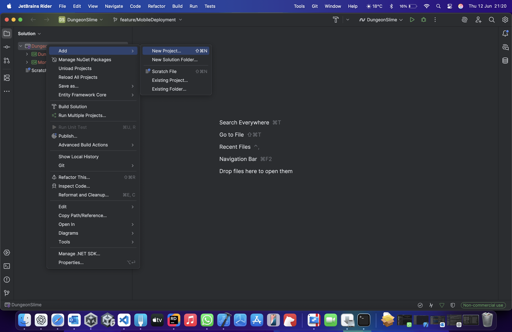
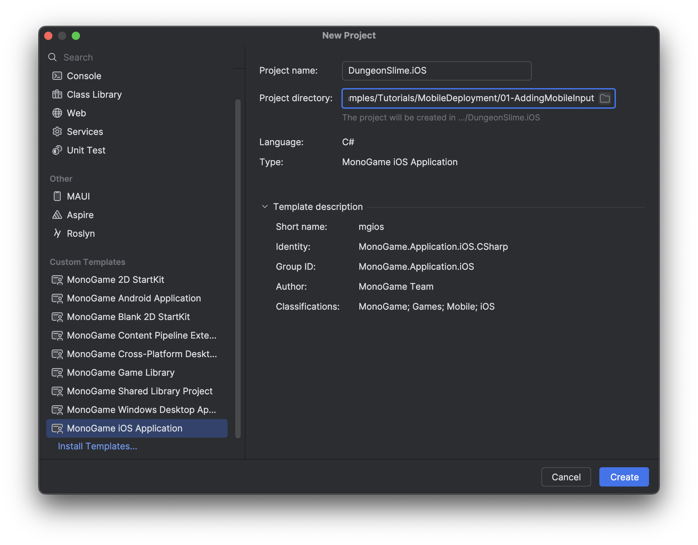
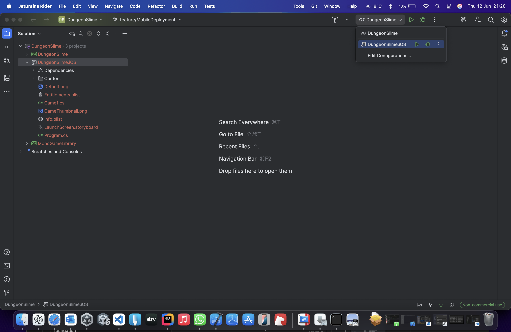
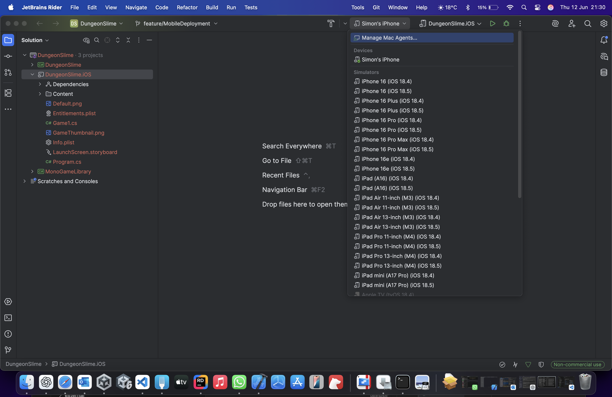
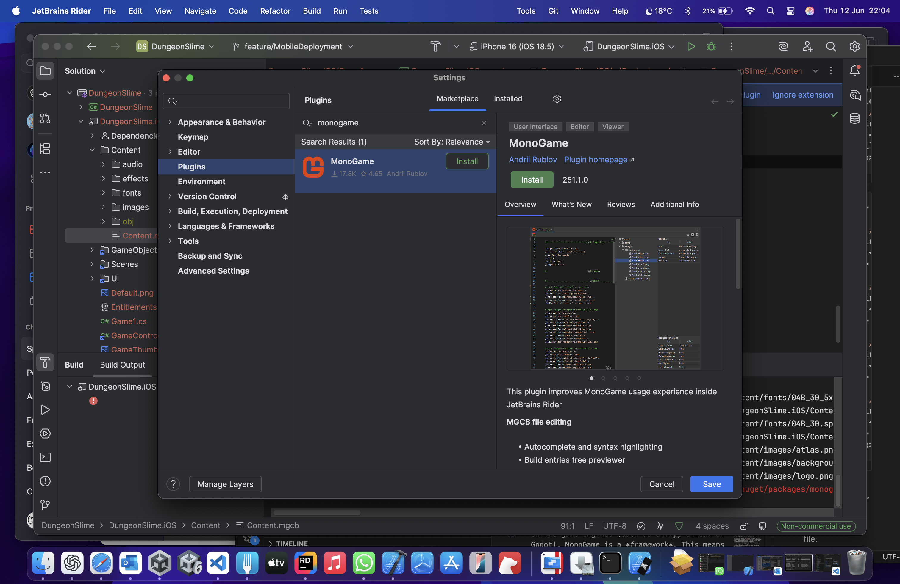

## Add IOS project to Solution










- Brew installation for mac
- Wine installation for mac for mgcb building.
- Ensure dotnet templates installed

# Android

## Android setup in Rider




# Adapting for iOS


Run and simulator launches.

# Sharing logic

DungeonSlim.iOS - add project reference to MonoGameLibrary project.

Game1.cs - copy from DungeonSlime project.

Add nuget package - Gum.MonoGame


Targeting monogame

```
<Project Sdk="Microsoft.NET.Sdk">
  <PropertyGroup>
    <TargetFrameworks>net8.0-windows;net8.0-ios</TargetFrameworks>
  </PropertyGroup>
  <ItemGroup Condition="'$(TargetFramework)' == 'net8.0-windows'">
    <PackageReference Include="MonoGame.Framework.DesktopGL" Version="3.8.*">
      <PrivateAssets>All</PrivateAssets>
    </PackageReference>
  </ItemGroup>
  <ItemGroup Condition="'$(TargetFramework)' == 'net8.0-ios'">
    <PackageReference Include="MonoGame.Framework.iOS" Version="3.8.*">
      <PrivateAssets>All</PrivateAssets>
    </PackageReference>
  </ItemGroup>
</Project>
```

Additions to the ios csproj:

```csharp
    <ItemGroup>
        <Compile Include="../DungeonSlime/Scenes/*.cs">
            <Link>Scenes\%(Filename)%(Extension)</Link>
        </Compile>
    </ItemGroup>
    <ItemGroup>
        <Compile Include="../DungeonSlime/GameController.cs"/>
    </ItemGroup>
    <ItemGroup>
        <Compile Include="../DungeonSlime/UI/*.cs">
            <Link>UI\%(Filename)%(Extension)</Link>
        </Compile>
    </ItemGroup>    <ItemGroup>
    <Compile Include="../DungeonSlime/GameObjects/*.cs">
        <Link>GameObjects\%(Filename)%(Extension)</Link>
    </Compile>
</ItemGroup>
```

```csharp
<ItemGroup>
    <None Include="../DungeonSlime/Content/images/*.*">
        <Link>Content\images\%(Filename)%(Extension)</Link>
    </None>
    <None Include="../DungeonSlime/Content/fonts/*.*">
        <Link>Content\fonts\%(Filename)%(Extension)</Link>
    </None>
    <None Include="../DungeonSlime/Content/effects/*.*">
        <Link>Content\effects\%(Filename)%(Extension)</Link>
    </None>
    <None Include="../DungeonSlime/Content/audio/*.*">
        <Link>Content\audio\%(Filename)%(Extension)</Link>
    </None>
</ItemGroup>
```

Copy asset files to Content folder
Add items to the content.mgcb file.


## Exit(); not supported in iOS


## MediaPlayer changes for iOS.

