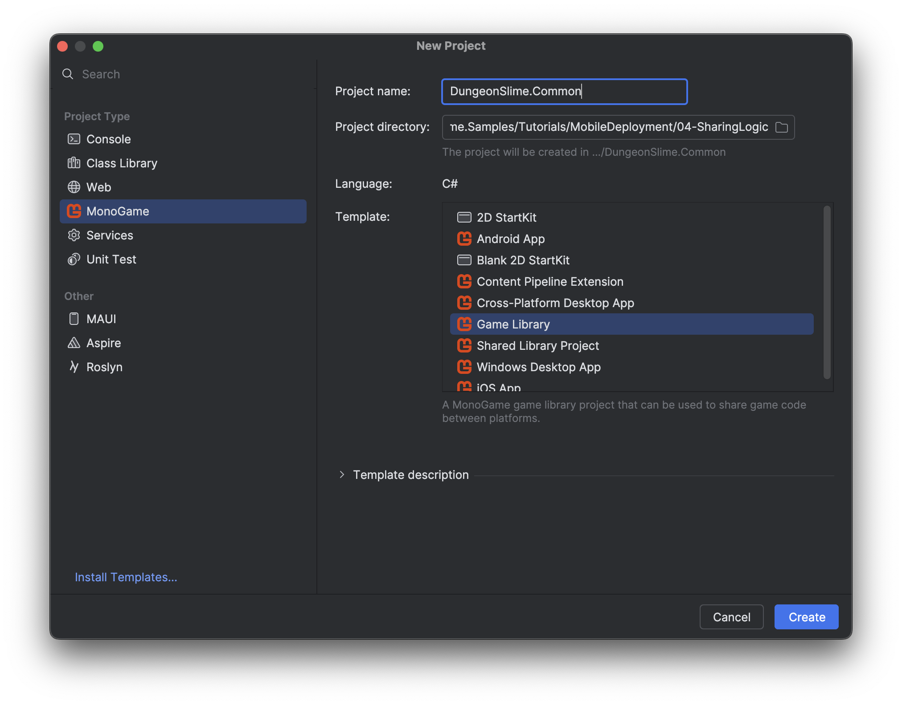
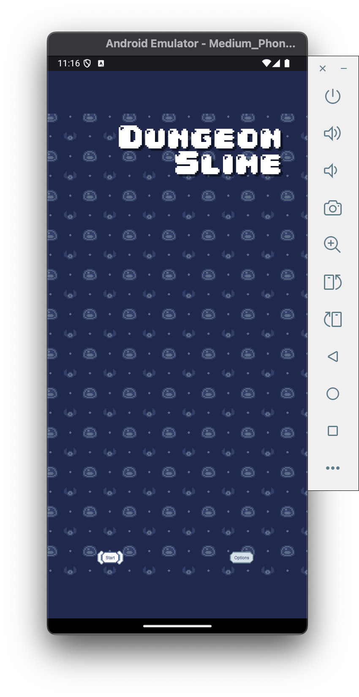
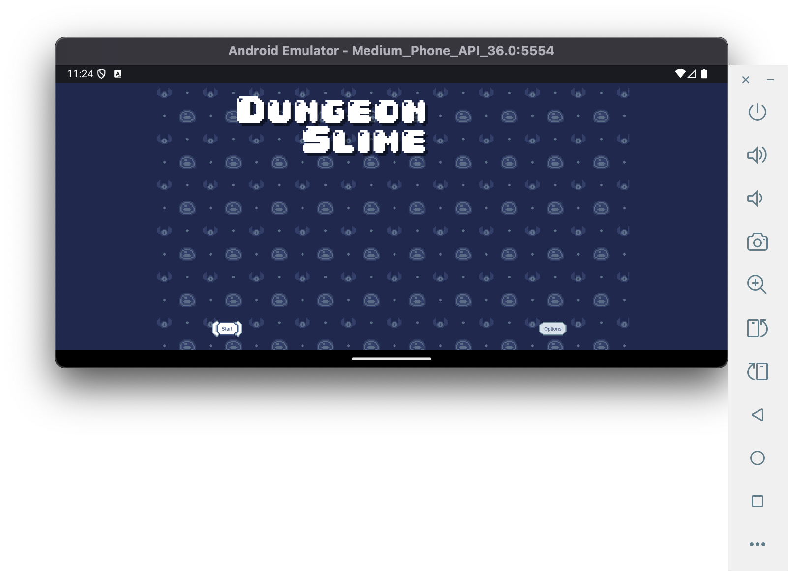
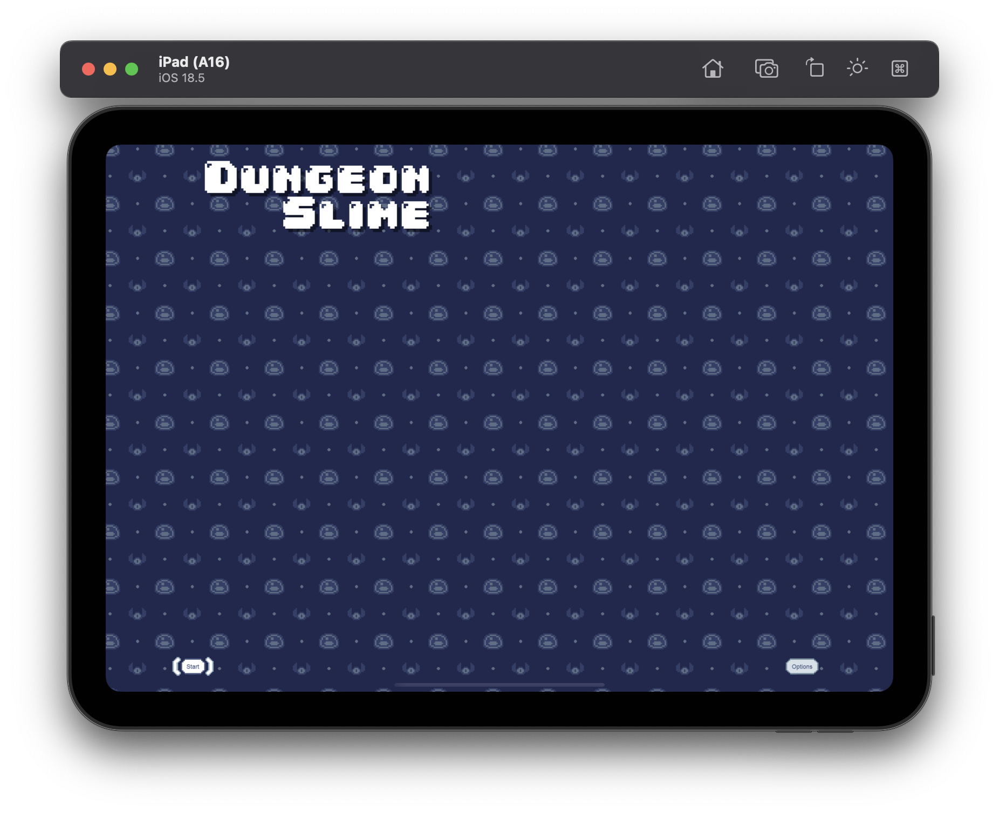

# Add common game library project.

# Add reference to all game projects.

# Moved game code from windows version to common project

- Removed game class from android and ios project.

# Content files

- Copy definitions to MGCB files.

# Android Emulator

Change orientation setting from:

        ScreenOrientation = ScreenOrientation.FullUser,

to:

        ScreenOrientation = ScreenOrientation.Landscape,

# iOS Emulator

