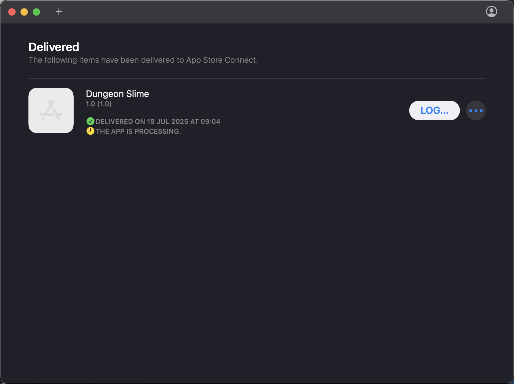
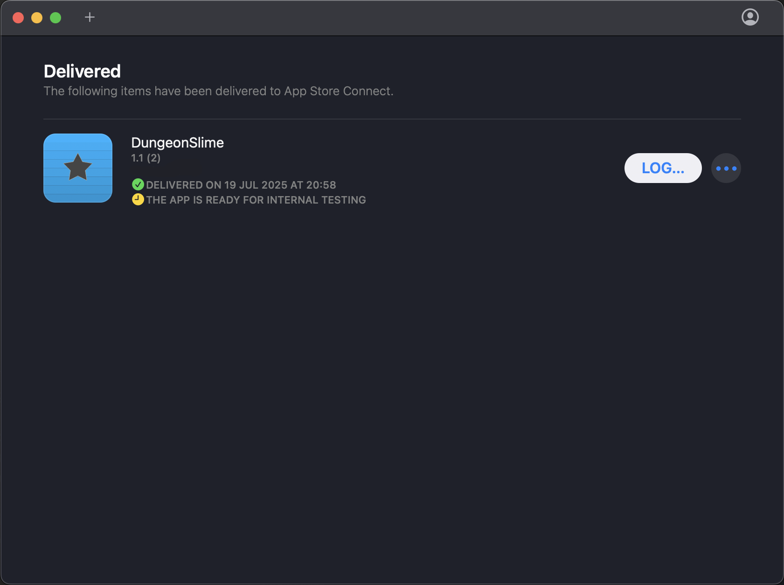

# Follow the instructions

To create your Certificate Signing Request (CSR), follow these instructions:

https://developer.apple.com/help/account/certificates/create-a-certificate-signing-request

Create your certificates and provisioning profiles.

# Packaging Details

In the iOS **csproj**:

```xml
<PropertyGroup>
	<SupportedOSPlatformVersion>12.2</SupportedOSPlatformVersion>
	<BundleIdentifier>com.companyname.dungeonslime</BundleIdentifier>
	<CFBundleIconName>AppIcon</CFBundleIconName>
</PropertyGroup>
```

in the **info.plist**:

```xml
	<key>CFBundleIdentifier</key>
	<string>com.companyname.dungeonslime</string>
	<key>MinimumOSVersion</key>
	<string>12.2</string>
```

# Assets

# asset.car

```xml
	<key>CFBundleIconName</key>
	<string>AppIcon</string>
	<key>CFBundleIcons</key>
	<dict>
		<key>CFBundlePrimaryIcon</key>
		<dict>
			<key>CFBundleIconName</key>
			<string>AppIcon</string>
		</dict>
	</dict>
```

# Versioning

info.plist

```xml
	<key>CFBundleVersion</key>
	<string>2</string>
	<key>CFBundleShortVersionString</key>
	<string>1.1</string>
```

Packaging

```bash
dotnet clean
rm -rf bin/ obj/
dotnet publish -c Release -f net8.0-ios -p:ArchiveOnBuild=true
```

# IPA


# Uploading to AppStore

Transporter upload

## TestFlight


Upload to AppStore which will perform final validation.

"THE APP IS PROCESSING"



All being well, it will give the green light for testing.

"THE APP IS READY FOR INTERNAL TESTING"



## Store Release

