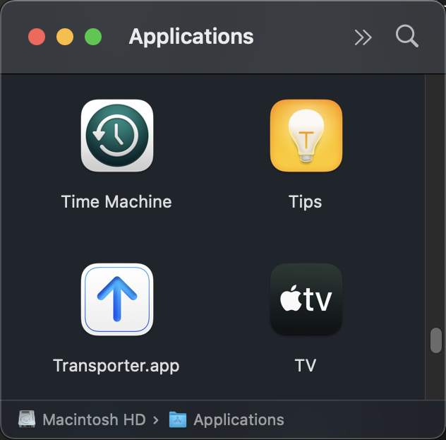
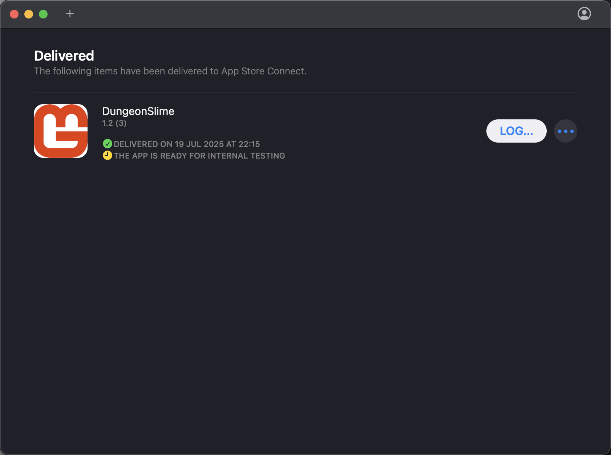
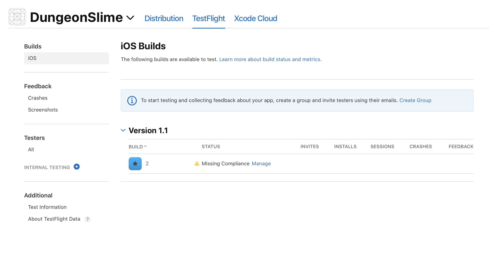
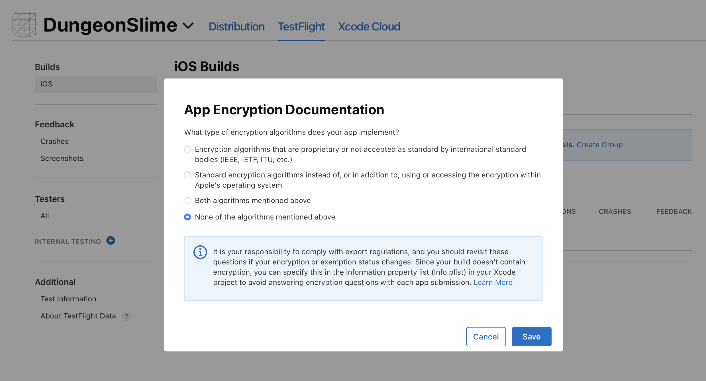
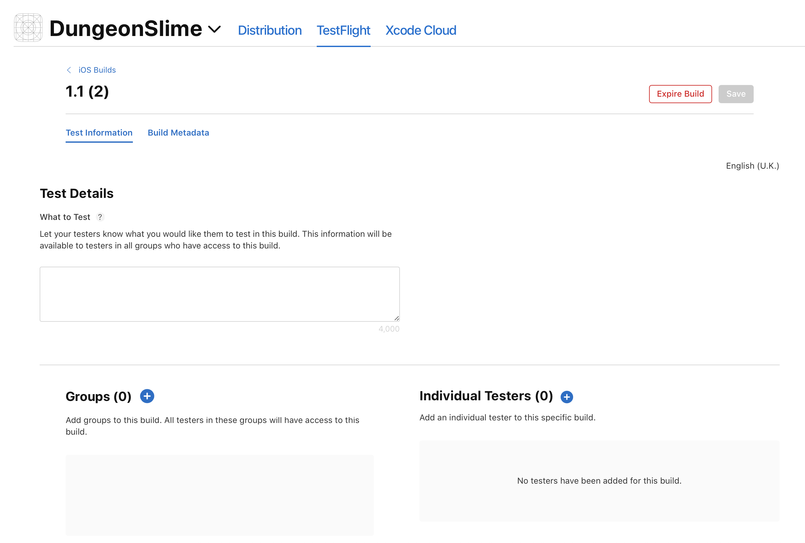
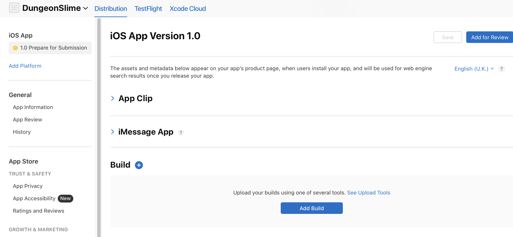
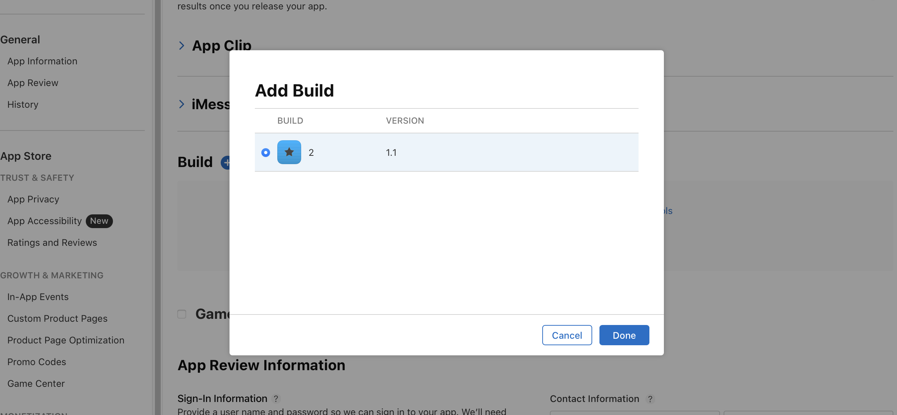

# Follow the instructions

To create your Certificate Signing Request (CSR), follow these instructions:

https://developer.apple.com/help/account/certificates/create-a-certificate-signing-request

Create your certificates and provisioning profiles.

# Packaging Details

In the iOS **csproj**:

```xml
<PropertyGroup>
	<SupportedOSPlatformVersion>12.2</SupportedOSPlatformVersion>
	<BundleIdentifier>com.companyname.dungeonslime</BundleIdentifier>
	<CFBundleIconName>AppIcon</CFBundleIconName>
</PropertyGroup>
```

in the **info.plist**:

```xml
<key>CFBundleIdentifier</key>
<string>com.companyname.dungeonslime</string>
<key>MinimumOSVersion</key>
<string>12.2</string>
```

# Assets

# asset.car

```xml
<key>CFBundleIconName</key>
<string>AppIcon</string>
<key>CFBundleIcons</key>
<dict>
	<key>CFBundlePrimaryIcon</key>
	<dict>
		<key>CFBundleIconName</key>
		<string>AppIcon</string>
	</dict>
</dict>
```

# Versioning

info.plist

```xml
<key>CFBundleVersion</key>
<string>2</string>
<key>CFBundleShortVersionString</key>
<string>1.1</string>
```

Packaging

```bash
dotnet clean
rm -rf bin/ obj/
dotnet publish -c Release -f net8.0-ios -p:ArchiveOnBuild=true
```

# IPA

```bash
DungeonSlime.iOS/bin/Release/net8.0-ios/ios-arm64/publish/DungeonSlime.iOS.ipa
```

# Uploading to AppStore

## Transporter



## TestFlight

Upload to AppStore which will perform final validation.

"THE APP IS PROCESSING"


All being well, it will give the green light for testing.

"THE APP IS READY FOR INTERNAL TESTING"



## Store Release












Some useful terminal commands:

```bash
xcrun devicectl list devices
```

```bash
# Install app on device using device name
xcrun devicectl device install app --device "Simon's iPhone" path/to/app.app

# Install app using device UDID
xcrun devicectl device install app --device A0567751-B61A-571F-B63E-8C26239EC5A9 path/to/app.app

# Install app using hostname
xcrun devicectl device install app --device "Simons-iPhone.coredevice.local" path/to/app.app

# Launch app on device
xcrun devicectl device process launch --device "Simon's iPhone" com.bundle.identifier
```

```bash
# List all code signing identities
security find-identity -v -p codesigning

# Show only developer certificates
security find-identity -v -p codesigning | grep Developer

# List provisioning profiles
ls ~/Library/MobileDevice/Provisioning\ Profiles/

# Examine provisioning profile content
security cms -D -i ~/Library/MobileDevice/Provisioning\ Profiles/profile-uuid.mobileprovision

# Get specific info from provisioning profile
security cms -D -i ~/Library/MobileDevice/Provisioning\ Profiles/profile-uuid.mobileprovision | grep -A10 "ProvisionedDevices"

# Check app's embedded provisioning profile
codesign -d --entitlements :- path/to/app.app

# Alternative entitlements check (without deprecated warning)
codesign -d --entitlements - path/to/app.app
```

```
# List installed .NET SDKs
dotnet --list-sdks

# List installed .NET runtimes
dotnet --list-runtimes

# Check .NET version
dotnet --version

# Check what .NET workloads are installed
dotnet workload list

# Update workloads
dotnet workload update

# Install iOS workload (if needed)
dotnet workload install ios
```

```
# Check Xcode path
xcode-select -p

# List available iOS simulators
xcrun simctl list devices

# Open Xcode Devices window
open -a Xcode
# Then Window > Devices and Simulators

# Check iOS SDK path
xcrun --show-sdk-path --sdk iphoneos
```

```
xcrun devicectl list devices
```

```
# 1. Check what profiles you have
ls ~/Library/MobileDevice/Provisioning\ Profiles/

# 2. Examine profile contents  
security cms -D -i ~/Library/MobileDevice/Provisioning\ Profiles/85c165b9-4a35-4833-ba65-7821259627f9.mobileprovision | grep -A10 "ProvisionedDevices"
```


